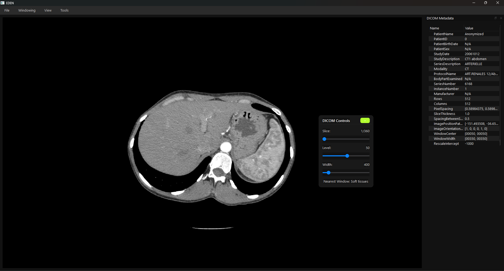
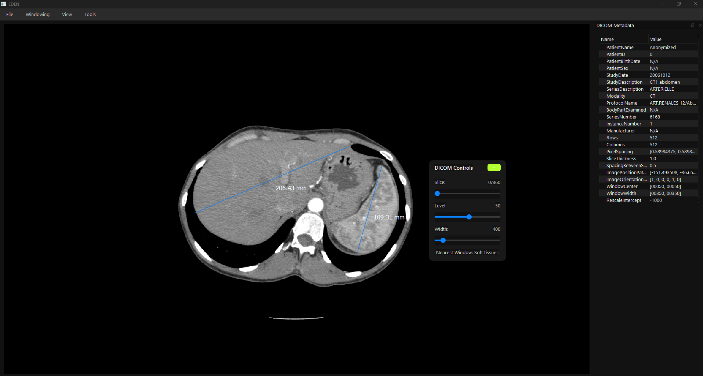

# Eden – Medical Image Viewer

**Eden** is a PyQt6-based medical image viewer designed for intuitive interaction with DICOM, NIfTI, and standard image formats. It offers essential image navigation tools alongside advanced capabilities like cine loop playback and measurement tools.

---

## 🧩 Features

### Basic Functionality
- **Slice Navigation** – Navigate through image slices using GUI slider or mouse wheel.
- **Windowing Control** – Adjust image contrast and brightness via sliders or right-click + drag.
- **DICOM Metadata Display** – View key metadata from loaded DICOM files.
- **Zoom & Pan** – Ctrl + Mouse Wheel to zoom, left-click drag to pan.

### Advanced Functionality
- **Fast Scrolling** – Shift + Mouse Wheel scrolls 10% of slices per action.
- **Preset Window Levels** – Use shortcuts (1–4) or Menu for presets (Brain, Lungs, Soft Tissue, Bone).
- **Cine Loop Playback** – Press `P` to play/pause slice looping. Playback speed is adjustable.
- **Distance Measurement** – Press `M` to measure distances between two points. Right-click to cancel.

---

## 📂 Supported File Formats

### Can Open:
- **DICOM** (`.dcm` folders)
- **NIfTI** (`.nii`, `.nii.gz`)
- **Images** (`.png`, `.jpg`, `.bmp`)

### Can Save As:
- **DICOM**
- **NIfTI**
- **PNG / JPG / BMP**
- **MP4** (cine loop export)

---

## 🖥️ Main UI Components

- **ViewerWidget** – Core rendering widget, handles slice updates and tool overlays.
- **CustomGraphicsView** – Interactive canvas for zoom, pan, measure, and overlays.
- **Floating Toolbar (DICOM Controls)** – Quick-access sliders for slice, window level, and width.
- **Save Menu Window** – Export view/data to DICOM, NIfTI, image, or MP4.
- **Toast Messages** – In-app, animated popup feedback.

---

## 🛠️ Project Structure

```plaintext
my_project/
├── controllers/
│   ├── cine_loop_controller.py        # Cine loop playback logic
│   ├── load_controller.py             # File loading controller
│   └── save_controller.py             # Export logic
│
├── data/
│   ├── dicom/
│   │   ├── dicom_loader.py            # Async DICOM loading
│   │   ├── dicom_loader_thread.py
│   │   └── dicom_reader.py
│   ├── nifti/
│   │   ├── NIfTI_loader.py            # Async NIfTI loader
│   │   ├── NIfTI_loader_thread.py
│   │   └── NIfTI_reader.py
│   └── data_manager.py                # Stores loaded image data
│
├── exporters/
│   ├── dicom_exporter.py              # Export to DICOM
│   ├── export_helpers.py              # Build headers / affine
│   ├── image_exporter.py              # Export to PNG/JPG
│   ├── nifti_exporter.py              # Export to NIfTI
│   └── video_exporter.py              # Export MP4 cine loops
│
├── image_processing/
│   ├── mask_utils.py                  # Overlay logic
│   ├── measurement_handler.py         # Measurement logic
│   └── windowing_manager.py           # Image contrast adjustment
│
├── ui/
│   ├── controls.py                    # UI sliders and elements
│   ├── floating_tool_bar.py          # Toolbar for DICOM controls
│   ├── graphics_view.py              # Custom QGraphicsView subclass
│   ├── loading_widget.py             # Animated loading indicator
│   ├── main_window.py                # Main application window
│   ├── menu_builder.py               # Constructs menu bar
│   ├── metadata_widget.py            # DICOM metadata display
│   ├── save_menu.py                  # Export options
│   ├── stylesheets.py                # Theming/styling
│   ├── toast.py                      # Toast animation widget
│   ├── toast_api.py                  # Toast messaging API
│   └── viewer_widget.py              # Central GUI image viewer
│
└── main.py                           # Entry point / application launcher
```

---

## 🚀 Getting Started

### Installation

1. Clone the repository:
   ```bash
   git clone https://github.com/PatrickDdx/eden-medical-viewer.git
   cd eden-medical-viewer
   ```

2. (Optional) Create a virtual environment:
   ```bash
   python -m venv venv
   source venv/bin/activate  # or venv\Scripts\activate on Windows
   ```

3. Install dependencies:
   ```bash
   pip install -r requirements.txt
   ```

4. Run the application:
   ```bash
   python my_project/main.py

   ```

---

## 📄 License

This project is licensed under the MIT License. See the [LICENSE](LICENSE) file for details.


## 📸 Demo & Screenshots






---
## 💻 Download

**Recommended:**  
👉 [View the latest release](https://github.com/PatrickDdx/eden-medical-viewer/releases/latest)

**Or** paste this link into your browser to download directly:

`https://github.com/PatrickDdx/eden-medical-viewer/releases/latest/download/EdenViewer.exe`

---

## 🙋‍♂️ Acknowledgments

- Anonymized DICOM samples courtesy of [DICOM Library](https://www.dicomlibrary.com/).
- Developed by **Patrick Linke**, 2025.

---

## 💬 Contact

Feel free to reach out via GitHub Issues for bugs or feature requests.
